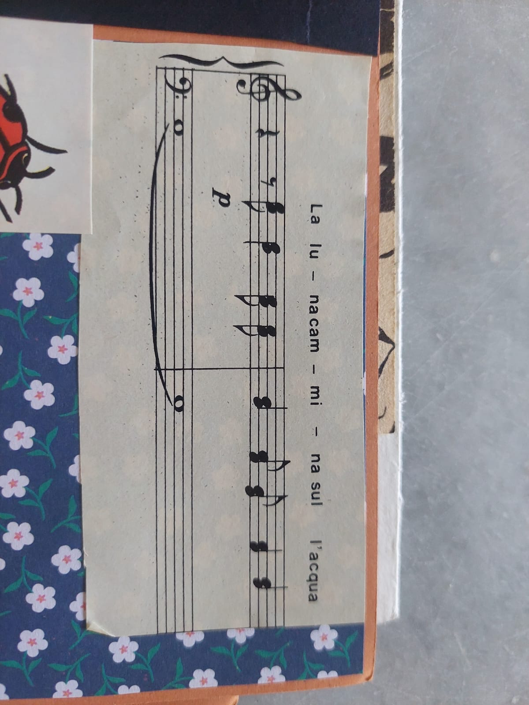
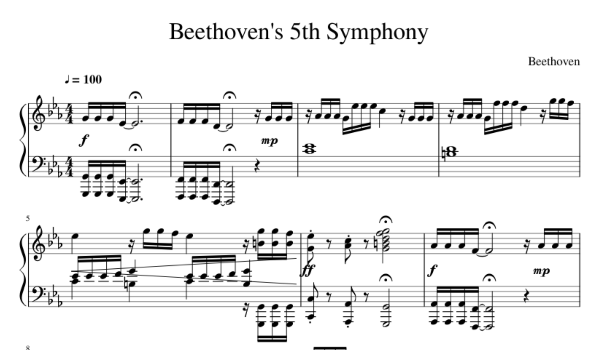

# musi

> "Can AI read sheet music?" — "Hold my metronome."

**musi** snaps a photo of sheet music, feeds it to an open-source vision AI, and spits out an MP3 you can actually listen to. Send it via Telegram or run it from the command line.

```
photo of sheet music → vision LLM reads the notes → synthesizer goes brrr → MP3
```

## Telegram Bot

The easiest way to use musi. Just open Telegram, find the bot, and send a photo.

**Commands:**
| Command | Description |
|---------|-------------|
| `/start` | Welcome message |
| `/help` | Tips for best results |
| `/instrument` | Choose instrument (piano, flute, organ, music_box, drums) |
| `/bpm` | Override tempo (e.g. `/bpm 120`, `/bpm auto`) |

**How it works:**
1. Send a photo of sheet music
2. The bot reads the notes with a vision AI
3. Synthesizes audio and sends back an MP3

Per-user preferences (instrument, BPM) are remembered during the session.

### Deploy with Docker

```bash
cp .env.example .env   # add your tokens
docker build -t musi-bot .
docker run -d --name musi-bot --restart unless-stopped --env-file .env musi-bot
```

## CLI

```bash
# basic — photo in, MP3 out
python3 musi.py spartito.jpg

# choose your instrument
python3 musi.py score.png --instrument drums

# just read the notes, no audio
python3 musi.py beethoven.jpg --dry-run

# override tempo, save note data
python3 musi.py waltz.jpg --bpm 120 --json

# custom output path
python3 musi.py photo.jpg -o my_melody.mp3
```

## Instruments

| Name | Vibe |
|------|------|
| `piano` | Classic. Default. Can't go wrong. |
| `flute` | Soft and breathy. Good for lullabies. |
| `organ` | Full and churchy. Bach would approve. |
| `music_box` | Tiny and sparkly. Instant nostalgia. |
| `drums` | Kick, snare, hihat, toms, ride, crash. For percussion scores. |

## Setup

```bash
pip install numpy scipy python-telegram-bot   # bot + audio synthesis
# ffmpeg required for MP3 (falls back to WAV if missing)

cp .env.example .env   # add your tokens
```

### Environment variables

| Variable | Default | Description |
|----------|---------|-------------|
| `TELEGRAM_BOT_TOKEN` | — | Telegram bot token from @BotFather |
| `OLLAMA_BASE_URL` | `http://localhost:11434/v1` | Vision API endpoint |
| `OLLAMA_API_KEY` | `ollama` | API key |
| `OLLAMA_VISION_MODEL` | `qwen3-vl:235b-cloud` | Vision model |

Works with [Ollama](https://ollama.com) (local or cloud), or any OpenAI-compatible vision API.

## Examples

Real results. No cherry-picking. These are actual outputs from `musi`.

### Italian lullaby — "La luna cammina sull'acqua"

A rotated phone photo of sheet music from an old songbook.



```bash
$ python3 musi.py examples/la_luna.png
[musi] title: La luna cammina sull'acqua
[musi] key: D minor, tempo: 80 bpm, notes: 8
[musi] lyrics: La lu - na cam - mi - na sul l'acqua
[musi] notes: D4, C4, Bb3, A3, Bb3, C4, D4, C4
```

[Listen to the result (examples/la_luna.mp3)](examples/la_luna.mp3)

<details>
<summary>Extracted JSON</summary>

```json
{
  "title": "La luna cammina sull'acqua",
  "key": "D minor",
  "time_signature": "3/4",
  "tempo_bpm": 80,
  "dynamics": "p",
  "lyrics": "La lu - na cam - mi - na sul l'acqua"
}
```

</details>

### Beethoven's 5th Symphony

The most recognizable four notes in music history. From a digital score.



```bash
$ python3 musi.py examples/beethoven_5th.png
[musi] title: Beethoven's 5th Symphony
[musi] key: Eb major, tempo: 100 bpm, notes: 82
[musi] notes: G3, G3, G3, Eb3, REST, F3, F3, F3, D3, ...
```

[Listen to the result (examples/beethoven_5th.mp3)](examples/beethoven_5th.mp3)

**G-G-G-Eb** — *ta-ta-ta-TAAAA!* Nailed it. 82 notes read from 2 systems of piano score, tempo picked up from the `♩= 100` marking.

## How accurate is it?

Honestly? It depends on the photo. Clean, high-res scans work great. Blurry phone photos of your grandma's songbook? It'll give it a solid try. The AI might occasionally hallucinate a sharp or miss a rest, but the melody will be recognizable. Think of it as "AI karaoke for sheet music."

## Tech stack

- **Vision**: Any Ollama-compatible multimodal model (tested with Qwen3-VL 235B)
- **Audio**: NumPy + SciPy (additive synthesis, ADSR envelopes, noise-based drums)
- **Encoding**: ffmpeg for MP3
- **Bot**: python-telegram-bot (async, polling mode)
- **Deploy**: Docker (python:3.12-slim + ffmpeg)

## License

MIT — do whatever you want with it. Make music. Have fun.
